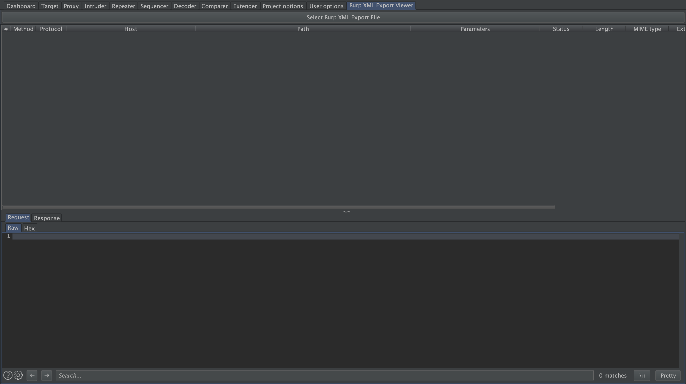

# Burp XML Export Viewer

This extension is designed to let you view your exported Burp Suite history files (in XML format) directly within a custom Burp tab. Note that this extension is only designed to render the exported XML file in a graphically readable form for later investigations.

# Installation

1. Make sure to set up the *Python Environment* in *Extender->Options*
2. In *Extender->Extensions* click on *Add* button
3. Select Extension Type *Python*
4. Select Extension file *BurpXMLExportViewer.py*
5. After loading the extension, a new tab called *Burp XML Export Viewer* should appear

Within this tab, click on *Select Burp XML Export File* and select your exported Burp XML history file. Note that no base64 encoded XML history files are supported yet. Thus, you need to uncheck *Base64-encode requests and responses* when exporting your items from Burp's HTTP Proxy history. Base64 support may be added in the future.

# TODOs

- [x] Handle base64 encoded XML history files
- [ ] Edit data and export as new XML history file
- [ ] Re-import XML history file into Burp Proxy

# Screenshot

